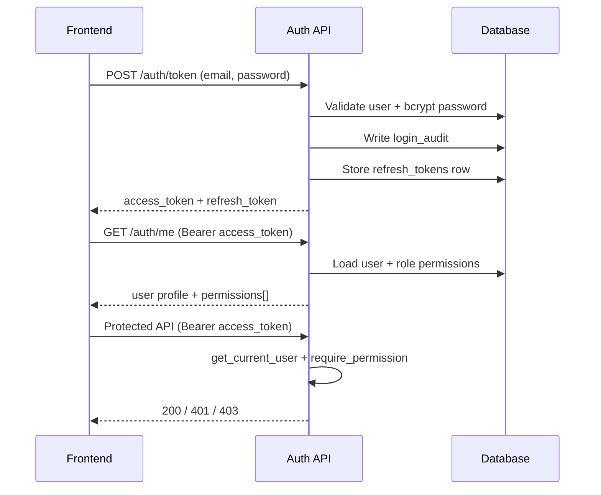
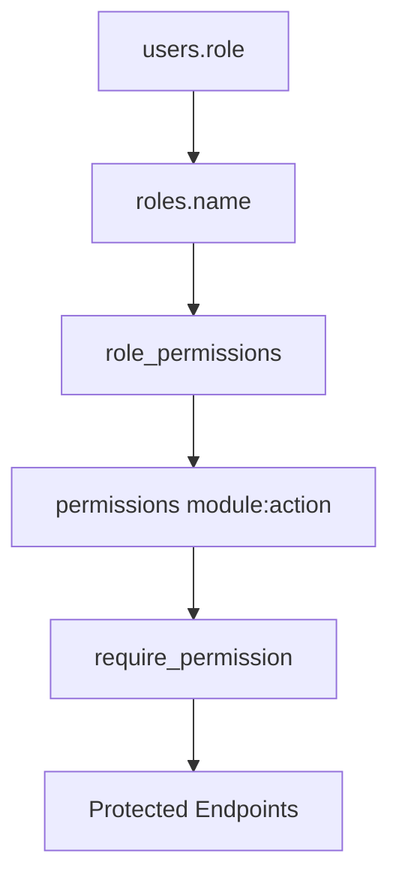

# SIMI RBAC and Authentication

## Overview

SIMI uses JWT bearer authentication with role-based access control (RBAC). The existing login endpoint (`POST /api/v1/auth/token`) is unchanged in contract and now also returns an optional `refresh_token`.

## Authentication Flow



## RBAC Architecture



## Database Schema

| Table | Purpose |
|-------|---------|
| `roles` | System roles (platform_admin, manager, viewer, ...) |
| `permissions` | Permission catalog (`module`, `permission`) |
| `role_permissions` | Many-to-many role → permission |
| `refresh_tokens` | Rotating refresh token hashes |
| `login_audit` | Login success/failure audit trail |
| `password_reset_tokens` | Password reset flow |
| `revoked_tokens` | Revoked JWT `jti` blocklist |
| `users.failed_login_attempts` | Account lockout counter |
| `users.locked_until` | Temporary lockout expiry |
| `users.last_login_at` | Last successful login timestamp |

## API Endpoints

| Endpoint | Auth | Description |
|----------|------|-------------|
| `POST /api/v1/auth/token` | Public | Login (unchanged contract + refresh_token) |
| `POST /api/v1/auth/refresh` | Public | Rotate refresh token |
| `POST /api/v1/auth/logout` | Bearer | Revoke access + refresh tokens |
| `GET /api/v1/auth/me` | Bearer | Profile + permissions |
| `POST /api/v1/auth/password` | Bearer | Change password |
| `POST /api/v1/auth/password-reset/request` | Public | Request reset token |
| `POST /api/v1/auth/password-reset/confirm` | Public | Confirm reset |

## Default Roles

| Role | Description |
|------|-------------|
| `platform_admin` | Full platform access |
| `support_engineer` | Full platform access |
| `implementation_manager` | Full platform access |
| `org_admin` | All tenant permissions except `admin:*` |
| `manager` | Create/update across modules |
| `agent` | Operational access (insurance, leads, tasks) |
| `viewer` | Read-only |
| `tenant_user` | Backward-compatible default tenant role |

## Permission Matrix (sample)

| Module | Permissions |
|--------|-------------|
| Insurance | `insurance:view`, `create`, `update`, `delete` |
| Claims | `claims:view`, `create`, `update`, `assign`, `close` |
| Reminders | `reminders:view`, `create`, `update`, `delete`, `process` |
| Leads | `leads:view`, `create`, `update`, `delete` |
| BMS | `bms:view`, `create`, `update`, `delete`, `assign` |
| Agents | `agents:view`, `create`, `update`, `delete`, `invoke` |
| Users | `users:view`, `create`, `update`, `delete`, `invite` |
| Admin | `admin:view`, `create`, `update`, `delete`, `onboard`, `invite` |
| Tasks | `tasks:view`, `create`, `update`, `delete`, `complete` |

## Role Hierarchy

```
Platform roles (platform_admin, support_engineer, implementation_manager)
  └── all permissions

Organization roles
  ├── org_admin (all tenant permissions)
  ├── manager (operational CRUD)
  ├── agent (field operations)
  └── viewer (read-only)
```

## Files Modified

### Backend
- `app/models/rbac.py`, `app/models/auth_security.py`
- `app/models/core.py` (user lockout fields)
- `app/core/permissions.py`, `app/core/security.py`, `app/core/config.py`
- `app/api/deps.py` (AuthenticatedUser, RBAC dependencies)
- `app/api/v1/endpoints/auth.py` (refresh, logout, reset, audit)
- All business endpoint routers (auth + permission guards)
- `app/services/rbac_service.py`, `app/services/auth_security_service.py`
- `app/seeds/rbac_seed.py`
- `alembic/versions/20260710_001_rbac_and_auth_security.py`
- `tests/integration/test_rbac_auth.py`, `tests/helpers/auth.py`

### Frontend
- `src/app/providers/workbench-provider.tsx` (permissions, secure logout)
- `src/lib/auth/permissions.ts`
- `src/pages/login.tsx`, `src/pages/master-login.tsx`
- `src/components/layout/app-shell.tsx` (permission-aware navigation)

## Migration Guide

1. Run Alembic migration:
   ```bash
   cd backend
   alembic upgrade head
   ```
2. RBAC seed runs automatically on app startup and first login.
3. Assign `users.role` to one of the seeded role names.
4. Existing `tenant_user` accounts keep working with backward-compatible permissions.

## Backward Compatibility

- `POST /auth/token` request/response shape preserved (`refresh_token` added optionally).
- Existing JWT access tokens without `jti` still validate.
- `users.role` string field remains the source of role assignment.
- `tenant_user` role maps to legacy tenant permissions.
- Webhook and internal scheduler routes remain on their existing secret-based auth.

## Security Features

| Feature | Status |
|---------|--------|
| bcrypt passwords | ✅ |
| JWT access tokens | ✅ |
| Refresh tokens + rotation | ✅ |
| Secure logout + revocation | ✅ |
| Password reset | ✅ |
| Login rate limiting | ✅ |
| Account lockout | ✅ |
| Login audit logs | ✅ |
| Organization isolation | ✅ |
